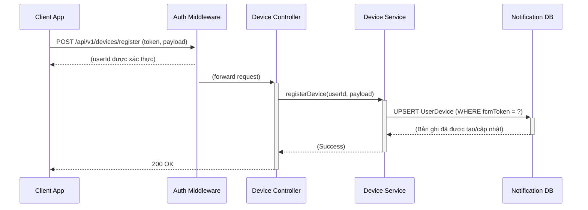
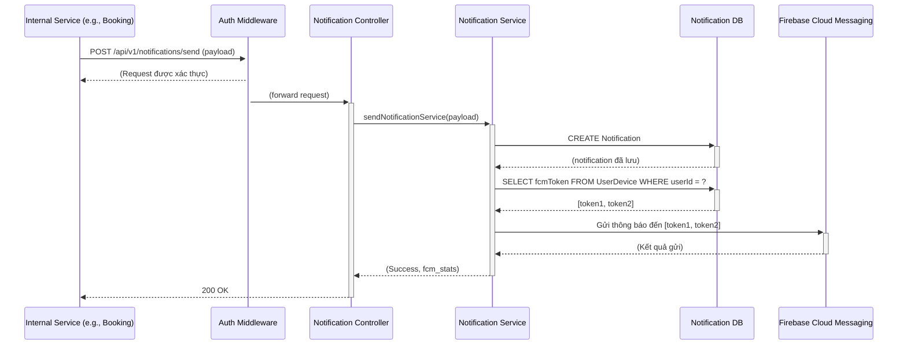
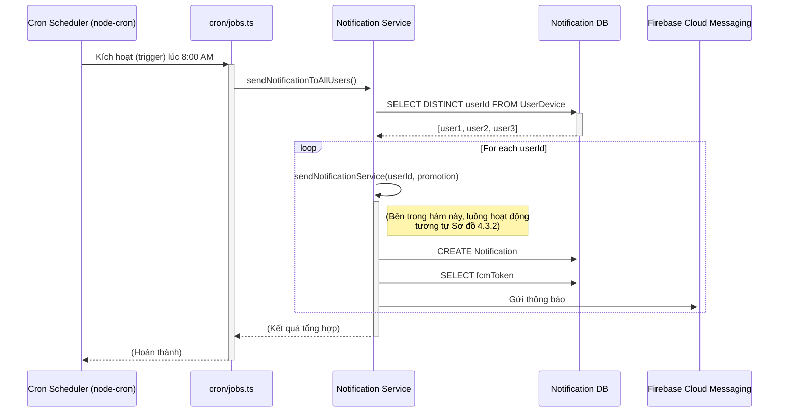

# BÁO CÁO TỔNG QUAN DỊCH VỤ - NOTIFICATION SERVICE
**Version: 2.0**
**Ngày cập nhật: 26/11/2025**

## 1. Giới thiệu tổng quan

### 1.1. Vai trò và chức năng

**Notification Service** là một phân hệ lõi (Core Service) trong kiến trúc microservices, chịu trách nhiệm quản lý và gửi đi tất cả các thông báo (đa kênh) đến người dùng cuối trong hệ sinh thái EV Rental. Service này đóng vai trò là một cổng giao tiếp tập trung, giúp các service nghiệp vụ khác (Booking, Auth, Vehicle...) tách biệt hoàn toàn khỏi logic phức tạp của việc gửi thông báo.

**Vai trò chính:**

*   **Cổng giao tiếp tập trung (Centralized Gateway):** Là điểm cuối duy nhất để các service khác gửi yêu cầu gửi thông báo, đảm bảo tính nhất quán và dễ dàng quản lý.
*   **Quản lý thiết bị người dùng (Device Management):** Lưu trữ và quản lý token của các thiết bị di động/web (qua FCM) mà người dùng đã đăng ký để nhận thông báo đẩy (push notification).
*   **Gửi thông báo đa kênh (Multi-channel Delivery):** Kiến trúc cho phép mở rộng để gửi thông báo qua nhiều kênh như Push Notification (Firebase Cloud Messaging), Email, SMS.
*   **Lưu trữ lịch sử (Notification Logging):** Ghi lại lịch sử các thông báo đã gửi cho từng người dùng, cho phép họ xem lại trong ứng dụng.

**Chức năng chính:**

*   **Đăng ký thiết bị:** Cung cấp API để ứng dụng client (iOS, Android, Web) đăng ký `fcmToken` của thiết bị với một `userId` cụ thể.
*   **Gửi thông báo:** Cung cấp API nội bộ cho các service khác gọi đến để gửi thông báo tới một hoặc nhiều người dùng.
*   **Truy vấn lịch sử:** Cung cấp API cho client lấy danh sách các thông báo đã nhận.
*   **Cập nhật trạng thái:** Cho phép đánh dấu một thông báo là "đã đọc" (isRead).

### 1.2. Phạm vi hoạt động (Scope)

**Trong phạm vi (In-Scope):**

*   Quản lý vòng đời của `UserDevice` (đăng ký, cập nhật token).
*   Tích hợp với các nhà cung cấp dịch vụ gửi thông báo bên thứ ba (ví dụ: Firebase Admin SDK).
*   Xây dựng và lưu trữ payload của thông báo vào bảng `Notification`.
*   Cung cấp API để gửi và truy vấn thông báo.

**Ngoài phạm vi (Out-of-Scope):**

*   **Không quyết định logic nghiệp vụ:** Service này không tự quyết định *khi nào* cần gửi thông báo (ví dụ: "gửi thông báo khi đơn hàng được xác nhận"). Việc này do các service nghiệp vụ như **Booking Service** chịu trách nhiệm.
*   **Không quản lý nội dung template:** Nội dung chi tiết của thông báo (`title`, `message`) được truyền từ service gọi đến.
*   **Không xử lý tương tác người dùng:** Việc người dùng bấm vào thông báo và điều hướng trong ứng dụng do Client App xử lý (dựa trên `url` được cung cấp trong payload).

## 2. Kiến trúc hệ thống

### 2.1. Vị trí trong kiến trúc Microservices (Context Diagram)

Notification Service là một service hỗ trợ (Utility Service), nhận các yêu cầu 비동기 (asynchronous) hoặc đồng bộ từ các service khác và giao tiếp với các dịch vụ bên ngoài (External Services).

*   **Luồng tương tác:**
    1.  **Client/Admin:** Người dùng đăng nhập vào app, Client App gửi request `POST /api/v1/devices/register` đến Notification Service để đăng ký thiết bị.
    2.  **Internal Services (Booking, Vehicle, Auth...):** Khi một sự kiện nghiệp vụ xảy ra (VD: `BOOKING_CONFIRMED`), service tương ứng sẽ gọi đến API nội bộ của Notification Service (VD: `POST /api/v1/notifications/send`) với `userId` và nội dung cần gửi.
    3.  **Firebase Cloud Messaging (FCM):** Notification Service sử dụng FCM Token lưu trong bảng `UserDevice` để gửi Push Notification đến đúng thiết bị của người dùng.
    4.  **Notification DB:** Service sở hữu một Database PostgreSQL riêng biệt để lưu trữ thông tin thiết bị và lịch sử thông báo.

### 2.2. Công nghệ sử dụng

*   **Ngôn ngữ lập trình:** Node.js (TypeScript)
*   **Web Framework:** Express.js
*   **Cơ sở dữ liệu (Database):** PostgreSQL
*   **ORM (Object-Relational Mapping):** Prisma
*   **Push Notification Provider:** Firebase Admin SDK
*   **Bảo mật & Middleware:** `helmet`, `cors`, `morgan`, `express-rate-limit`.
*   **Kiến trúc:** Microservices, Database-per-Service.
*   **Hạ tầng & Triển khai:** Đóng gói bằng Docker.

## 3. Thiết kế cơ sở dữ liệu (Dựa trên schema.prisma)

### 3.1. Tổng quan ERD

Cơ sở dữ liệu của Notification Service được thiết kế đơn giản để phục vụ hai mục đích chính: quản lý thiết bị có thể nhận thông báo và ghi lại lịch sử các thông báo đã gửi.

*   `UserDevice`: Bảng lưu trữ "địa chỉ" để gửi push notification.
*   `Notification`: Bảng hoạt động như một "hộp thư đến" (inbox) cho mỗi người dùng.

### 3.2. Chi tiết bảng

#### 1. Bảng `Notification` (Lịch sử thông báo)

Đây là bảng trung tâm lưu trữ nội dung và trạng thái của mỗi thông báo được gửi tới người dùng.

*   **Khóa chính:** `id` (UUID)

| Tên trường  | Kiểu dữ liệu (PostgreSQL) | Ràng buộc      | Mô tả                                                       |
| :---------- | :------------------------ | :------------- | :---------------------------------------------------------- |
| `id`        | `TEXT / UUID`             | PK, Not Null   | Định danh duy nhất của thông báo.                           |
| `title`     | `TEXT`                    | Nullable       | Tiêu đề của thông báo.                                      |
| `message`   | `TEXT`                    | Not Null       | Nội dung chính của thông báo.                               |
| `isRead`    | `BOOLEAN`                 | Default: false | Trạng thái đã đọc hay chưa.                                 |
| `type`      | `ENUM (NotificationType)` | Default: INFO  | Loại thông báo (VD: `BOOKING_CONFIRMED`, `SYSTEM_ALERT`).    |
| `url`       | `TEXT`                    | Nullable       | Đường dẫn để điều hướng khi người dùng nhấp vào (deep-link). |
| `createdAt` | `DateTime`                | Default: now() | Thời điểm tạo.                                              |
| `updatedAt` | `DateTime`                | @updatedAt     | Thời điểm cập nhật cuối.                                    |
| `userId`    | `TEXT`                    | Not Null       | ID của người dùng nhận thông báo.                           |

#### 2. Bảng `UserDevice` (Thiết bị người dùng)

Lưu trữ thông tin cần thiết để gửi push notification qua Firebase.

*   **Khóa chính:** `id` (UUID)

| Tên trường     | Kiểu dữ liệu | Ràng buộc      | Mô tả                                                   |
| :------------- | :----------- | :------------- | :------------------------------------------------------ |
| `id`           | `TEXT / UUID`| PK, Not Null   | Định danh duy nhất của bản ghi.                         |
| `userId`       | `TEXT`       | Not Null       | ID của người dùng sở hữu thiết bị.                      |
| `fcmToken`     | `TEXT`       | Unique, Not Null | Token do Firebase cấp cho mỗi thiết bị, dùng để gửi push. |
| `platform`     | `TEXT`       | Not Null       | Nền tảng thiết bị ('ios', 'android', 'web').            |
| `deviceName`   | `TEXT`       | Nullable       | Tên của thiết bị (VD: "Cao Ha's iPhone 15 Pro").      |
| `lastActiveAt` | `DateTime`   | Default: now() | Thời điểm cuối cùng thiết bị hoạt động.                  |
| `createdAt`    | `DateTime`   | Default: now() | Thời điểm tạo.                                          |
| `updatedAt`    | `DateTime`   | @updatedAt     | Thời điểm cập nhật cuối.                                |

#### 3.2.3. Enum `NotificationType`
Dùng để phân loại thông báo, giúp client có thể hiển thị icon hoặc xử lý logic khác nhau.
*   `NEW_MESSAGE`
*   `NEW_FOLLOWER`
*   `SYSTEM_ALERT`
*   `BOOKING_CONFIRMED`
*   `BOOKING_REMINDER`
*   `PROMOTION` - **(Mới)** Thông báo khuyến mãi, quảng cáo.
*   `INFO`

## 4. Quy trình hoạt động & Thiết kế chi tiết

### 4.1. Sơ đồ Use Case (Use Case Diagram)

*   **Tác nhân (Actors):**
    *   `Client App`: Đại diện cho người dùng cuối tương tác qua ứng dụng.
    *   `Internal Microservice`: Các service khác trong hệ thống (Booking, Vehicle...).
    *   `Scheduler`: **(Mới)** Hệ thống chạy nền thực thi các tác vụ định kỳ.
*   **Các Use Case:**
    *   `Register Device`: Client App đăng ký thiết bị.
    *   `Get Notifications`: Client App lấy lịch sử thông báo.
    *   `Mark Notification as Read`: Client App cập nhật trạng thái thông báo.
    *   `Send Manual Notification`: Internal Microservice gửi một thông báo nghiệp vụ.
    *   `Send Promotional Notification`: **(Mới)** Scheduler tự động gửi thông báo quảng cáo.

### 4.2. Luồng nghiệp vụ (Business Flows)

#### 4.2.1. Luồng Đăng ký Thiết bị (Device Registration Flow)
1.  Người dùng đăng nhập thành công trên Client App.
2.  Client App lấy được `fcmToken` từ Firebase SDK.
3.  Client App gọi API `POST /api/v1/devices/register` với payload chứa `fcmToken`, `platform`, `deviceName`.
4.  Notification Service nhận request, xác thực `userId` từ token.
5.  Service thực hiện logic "upsert":
    *   Nếu `fcmToken` đã tồn tại, cập nhật `lastActiveAt`.
    *   Nếu `fcmToken` chưa có, tạo một bản ghi `UserDevice` mới.

#### 4.2.2. Luồng Gửi Thông báo Thủ công (Manual Notification Sending Flow)
1.  Một sự kiện xảy ra ở một service khác (VD: Booking Service xác nhận đơn hàng).
2.  Booking Service gọi API nội bộ `POST /api/v1/notifications/send` của Notification Service.
3.  Notification Service lưu thông tin vào bảng `Notification`.
4.  Service tìm tất cả `fcmToken` trong bảng `UserDevice` ứng với `userId`.
5.  Sử dụng Firebase Admin SDK, service gửi push notification đến các `fcmToken` tìm được.

#### 4.2.3. Luồng Gửi Thông báo Tự động (Automated Cron Job Flow)
Đây là một luồng hoạt động nội bộ, được kích hoạt tự động theo lịch trình.

1.  **Khởi tạo và Lập lịch:** Khi Notification Service khởi động, `src/cron/jobs.ts` được import, sử dụng `node-cron` để lập lịch một tác vụ chạy vào lúc 8:00 sáng hàng ngày (Timezone: `Asia/Ho_Chi_Minh`).
2.  **Thực thi tác vụ:** Vào đúng 8:00 sáng, cron job được kích hoạt. Nó gọi hàm `sendNotificationToAllUsers` trong `notification.service.ts`.
3.  **Lấy danh sách người dùng:** Hàm này truy vấn vào bảng `UserDevice` để lấy danh sách các `userId` duy nhất đã đăng ký nhận thông báo.
4.  **Gửi hàng loạt:** Với mỗi `userId` trong danh sách, hệ thống sẽ lặp lại **"Luồng Gửi Thông báo"** (mục 4.2.2) với nội dung khuyến mãi được định sẵn và `type` là `PROMOTION`.

### 4.3. Sơ đồ tuần tự (Sequence Diagrams)

#### 4.3.1. Sơ đồ tuần tự: Đăng ký thiết bị


#### 4.3.2. Sơ đồ tuần tự: Gửi thông báo thủ công


#### 4.3.3. Sơ đồ tuần tự: Gửi thông báo tự động (Cron Job)


## 5. API & Endpoints Overview

### 5.1. Danh sách các API

Tất cả các API đều yêu cầu xác thực qua `authMiddleware`.

#### a. Device APIs (Quản lý thiết bị)

| Method | Endpoint                  | Mô tả                                                        |
| :----- | :------------------------ | :----------------------------------------------------------- |
| `POST` | `/api/v1/devices/register` | Đăng ký một thiết bị mới hoặc cập nhật thiết bị đã có để nhận push notification. |

#### b. Notification APIs (Quản lý thông báo)

| Method  | Endpoint                                | Mô tả                                                              |
| :------ | :-------------------------------------- | :----------------------------------------------------------------- |
| `POST`  | `/api/v1/notifications/send`            | (Dành cho internal service) Gửi một thông báo đến người dùng.       |
| `GET`   | `/api/v1/notifications/:userId`         | Lấy danh sách lịch sử thông báo của một người dùng.                |
| `PATCH` | `/api/v1/notifications/:notificationId/read` | Đánh dấu một thông báo cụ thể là đã đọc (`isRead = true`).         |

### 5.2. Ví dụ Payload chi tiết

#### 1. Request: Đăng ký thiết bị (POST /devices/register)
```json
{
  "fcmToken": "bk3RNwTe3H0:CI2k_HHwgIpoDKCIZvvDMExUdFQ3P1...",
  "platform": "ios",
  "deviceName": "My iPhone 15 Pro"
}
```

#### 2. Response: Lấy danh sách thông báo (GET /notifications/:userId)
```json
[
    {
        "id": "a1b2c3d4-e5f6-...",
        "title": "Đặt xe thành công!",
        "message": "Đơn hàng #BK123 của bạn đã được xác nhận.",
        "isRead": false,
        "type": "BOOKING_CONFIRMED",
        "url": "/bookings/BK123",
        "createdAt": "2025-11-26T10:00:00.000Z",
        "userId": "user-abc-123"
    },
    {
        "id": "f6e5d4c3-b2a1-...",
        "title": "Nhắc nhở lịch trình",
        "message": "Bạn có một chuyến đi sắp tới vào lúc 14:00 hôm nay.",
        "isRead": true,
        "type": "BOOKING_REMINDER",
        "url": "/bookings/BK119",
        "createdAt": "2025-11-25T18:30:00.000Z",
        "userId": "user-abc-123"
    }
]
```

## 6. Cấu hình & Triển khai

### 6.1. Biến môi trường (.env)

| Biến                          | Mô tả                                                        |
| :---------------------------- | :----------------------------------------------------------- |
| `PORT`                        | Cổng chạy service (VD: 8083).                                 |
| `NODE_ENV`                    | Môi trường (development, production).                         |
| `NOTIFICATION_DATABASE_URL`   | Chuỗi kết nối PostgreSQL cho Notification DB.                |
| `FIREBASE_SERVICE_ACCOUNT_KEY`| Chuỗi JSON chứa service account key của Firebase project để xác thực Admin SDK. |

### 6.2. Quy trình Docker hóa (Dockerization)

Sử dụng multi-stage build trong `Dockerfile` để tối ưu kích thước image cho production:

1.  **Stage `builder`:** Cài đặt dependencies, biên dịch TypeScript ra JavaScript.
2.  **Stage `runner`:** Sử dụng image Node.js Alpine nhẹ, chỉ copy code đã biên dịch và các dependencies cần thiết cho production.

**Lệnh khởi chạy trong container:**
```bash
# 1. Áp dụng các thay đổi schema vào database
npx prisma migrate deploy

# 2. Khởi động service
npm start
```
